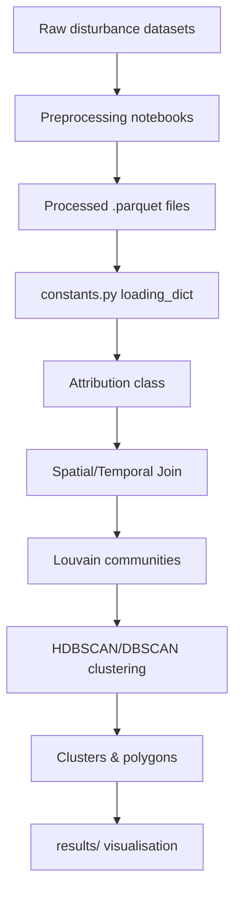

# Context 

This repository is used for my PhD research about Forest Disturbances. 

It has two main objectives : 
- Preprocess datasets
- Join datasets by using Louvain Communities and HDBSCAN in order to have better information on disturbance events in France

It has been coded while ago. It's very messy. I want to refactor eveything to have a more clean and lean code that respects PEP8 and best practices. 

# Repository structure 

Old codes can be found in the following folders : 
- annotation/
- join_datasets/
- process_datasets/
- results/
- sampling/
- visualisation/

In join_datasets, experiences.ipynb defines the latest experiments conducted to build this pipeline : Once de the datasets are preprocessed we can join them using Louvain Communities and then apply HDBSCAN on those communities to get better information on each disturbance event. 

# Aim 

New code, simplified, relying on PEP8 and OOP. 

**Structure :** 
excerpts/ 
src/
- __init__.py 
- preprocessing/
- join/
- utils.py
- constants.py
tests/
results/

  
## Pipeline Overview



The notebooks under `process-datasets/` generate simplified Parquet files. They
are loaded according to paths defined in `join-datasets/constants.py`. The
`Attribution` (or `Attribution2`) class performs a spatial join with a tree-cover
loss reference grid, builds similarity matrices and clusters events. Community
detection relies on Louvain; final clusters are produced with DBSCAN or HDBSCAN.

## Latest Experiment Notes

The notebook `join-datasets/experiences.ipynb` contains the most up‑to‑date
experiments. During graph construction the algorithm adaptively increases
thresholds when the graph is not connected:

```text
graph not connected, new thresholds : 1200m, 720d
graph not connected, new thresholds : 2400m, 1440d
graph not connected, new thresholds : 4800m, 2880d
graph not connected, new thresholds : 9600m, 5760d
```

Islands built from those graphs show a very high conversion rate with median
cluster size growing with the aggregation resolution:

```text
conversion rate : 99.84%
median : 5.0, std : 41.61933939084472
conversion rate : 99.84%
median : 7.0, std : 23.250562281483898
conversion rate : 99.84%
median : 9.0, std : 17.4255867488069
conversion rate : 99.84%
median : 9.0, std : 14.45200604486936
conversion rate : 99.84%
median : 10.0, std : 12.699904343020236
```

## Refactoring Guidelines

- Keep only the `_v2` implementations in `join-datasets/utils.py`.
  These include `build_temporal_matrix_v2`, `compute_tree_coherence_v2`,
  `compute_class_similarity_v2`, `compute_spatial_distance_v2`,
  `build_custom_matrix_v2`, `get_matrices_v2`, `build_similarity_v2`,
  `get_temporal_period_v2`, `get_spatial_polygon_v2` and `get_cluster_v2`.
-  The `Attribution2` class should be rewritten and simplified along the method.
- Target structure is `src/` with OOP modules and PEP8 compliant code.

## Dataset Columns

Each processed dataset should include common attributes so the join and
clustering algorithms operate correctly:

- `geometry` – polygon or point in EPSG:2154
- `start_date` – disturbance start
- `end_date` – disturbance end
- `class` – dataset specific disturbance class
- `dataset` – dataset name
- `year` – fallback year when precise dates are absent

Additional attributes improve the updated similarity functions:

- `cause` – disturbance cause
- `tree_type` – broad tree type
- `essence` – tree species

If any of these optional fields cannot be populated during preprocessing it is
acceptable. The pipeline still runs, but similarity scoring may be less
accurate.

## Datasets

Only the following data will be used : 
- cdi (information on droughts)
- hm (information on biotic agents)
- Senf&Seidl (accurate segmentation and basic classification in three classes)
- firepolygons (fires)
- forms (clear cut) 

Other data sources are not relevant or have too much uncertainties. 

## Phase 1: Raw Data Excerpt Creation

Before refactoring the main preprocessing and joining pipelines, a set of raw data excerpts has been created. This serves multiple purposes:
- To have small, manageable versions of the raw datasets for faster iteration when developing and testing new preprocessing scripts.
- To ensure a consistent area of interest (BBOX) is used for initial processing tests.
- To identify and handle initial data loading, CRS, and data type issues early on.

**Process:**
- Python scripts were developed in a new `data_excerpt_creation/` directory to process each of the key raw datasets:
    - Senf & Seidl maps (disturbance cause and year rasters)
    - Health Monitoring (tabular data to vector points)
    - Fire Polygons (vector polygons and tabular attributes)
    - Combined Drought Indicator (CDI) (raster time series)
    - FORMS (forest height raster)
- These scripts perform tasks like:
    - Reading various raw data formats (GeoTIFF, Excel, GPKG, CSV).
    - Cropping raster and vector data to a predefined BBOX: `(307783.0822, 6340505.4366, 469246.8845, 6419190.9011)` in EPSG:2154.
    - Reprojecting data to the target CRS (EPSG:2154) or ensuring the BBOX is correctly transformed for cropping in the source CRS.
    - Optimizing data types (e.g., `uint8`, `int16`) and applying compression (e.g., LZW for rasters) to reduce file size.
    - Implementing strategies to meet file size targets (e.g., iterative BBOX reduction, direct BBOX scaling based on size ratios, row sampling for vector data).
    - Handling mixed data types and potential errors during conversion (e.g., to Parquet).
- The generated excerpts are stored in the `excerpts/raw/` directory, often within type-specific subdirectories like `excerpts/raw_raster/`, `excerpts/raw_vector/`, and `excerpts/raw_tabular/`.

**Documentation:**
A detailed summary of how each raw data excerpt is created, including any changes in file type or structure from the original, is maintained in `excerpts/excerpts_creation_summary.md`. This document is crucial for understanding the starting point for the new preprocessing scripts.

A `progress.md` file is also kept to log the day-to-day steps taken during this and subsequent refactoring phases.

