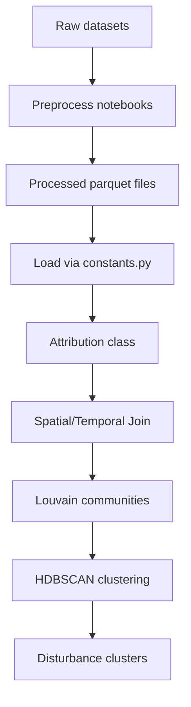

# Disturbance-Attribution-Dataset-Joining

Disturbance Attribution by Dataset Temporo-Spatial Joining. This project merges multiple disturbance detection sources with a common reference so that each event is attributed to a disturbance type.

## Project Objectives
- Preprocess several raw disturbance datasets.
- Join datasets with a reference temporal/spatial grid.
- Attribute disturbances to produce clusters and summary outputs.

## High Level Workflow

1. **Preprocessing**: run the notebooks in `process-datasets/` to convert raw files to simplified `.parquet` datasets.
2. **Join and Attribution**: use the modules in `src/join_datasets/` to perform the temporo–spatial join and cluster attribution.
3. **Visualisation and Analysis**: notebooks in `visualisation/` explore the output clusters and weighting functions.

## Prerequisites and Installation
- Python 3.9 or later.
- Install dependencies with
```bash
pip install -r requirements.txt
```

## Running Preprocessing
Open each notebook in `process-datasets/` and run it from top to bottom. The notebooks download or read the raw disturbance data and output simplified `.parquet` files in `data/processed_datasets/`. These paths correspond to `loading_dict` in `join-datasets/constants.py`.

## Running the Attribution Script
The code has been refactored into a standard package under `src/join_datasets`.
After loading the datasets using the paths in `constants.py`, you can compute clusters for a given year:
```python
from attribution import Attribution
from constants import loading_dict, DCLASS_SCORE, ddataset_profile, ddisturbance_profile

datasets = {name: gpd.read_parquet(path) for name, path in loading_dict.items()}
attr = Attribution(datasets, reference=tcl, doa=doa, dtypes=dtypes,
                   temporal_buffer=temporal_buffer, dsbuffer=dsbuffer,
                   dclass_score=DCLASS_SCORE, ddataset_profile=ddataset_profile,
                   ddisturbance_profile=ddisturbance_profile, start_year=2017)
attr.get_clusters(2017, dcustom_similiraity_function, dir_="../data/results/cluster_2017")
```
Outputs include `disturbances_<year>_g<granularity>_v<version>.parquet` and `clusters_<year>_g<granularity>_v<version>.parquet` saved in the directory you specify.

## Input Data Locations
`join-datasets/constants.py` expects processed datasets at
```
../data/processed_datasets/simplified_<dataset>_EPSG2154_FR.parquet
```
relative to the `join-datasets` folder. Create the `data/processed_datasets/` directory at the repository root and place the processed `.parquet` files there.

## Disturbance Data Sources
Links for downloading disturbances used in this project:
- **Senf & Seidl maps** – https://zenodo.org/record/8202241 and https://zenodo.org/record/7080016
- **Patacca et al. DFDE** – https://dfde.efi.int/db/dfde_app.php
- **BDIFF Fire Database** – https://bdiff.agriculture.gouv.fr/
- **Combined Drought Indicator** – https://edo.jrc.ec.europa.eu/

## Documentation
The preprocessing notebooks are described in [docs/preprocessing.md](docs/preprocessing.md).
The attribution workflow is explained in [docs/attribution.md](docs/attribution.md).
For further methodological context see `draft_article`.

## Tests
Run the unit tests with:
```bash
python -m unittest discover tests
```


