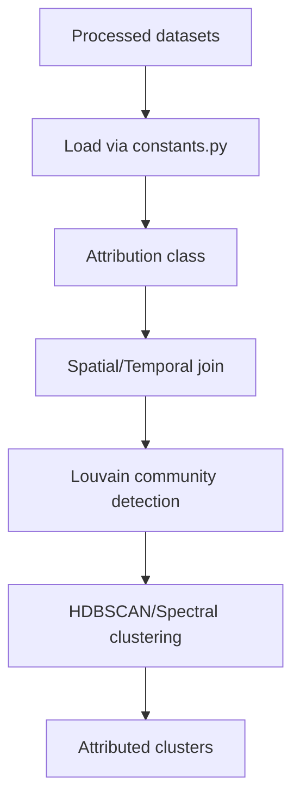

# Dataset Preprocessing and Attribution Workflow

This document provides a concise walkthrough of how to create the processed datasets and run the attribution pipeline. It complements the main `README`.

## 1. Preprocessing Each Dataset

The `process-datasets/` folder contains one notebook per raw dataset. Run these notebooks sequentially to produce simplified Parquet files in `data/processed_datasets/`.

Below is a short description of each preprocessing notebook.

### Senf & Seidl Disturbance Maps
- **Notebook**: `Process_SenfSeidlmap.ipynb`
- **Inputs**: yearly disturbance maps (attribution and year) from Senf & Seidl.
- **Steps**: convert the raster tiles to polygons, spatially join the attribution and year layers, merge polygons per disturbance type, and output yearly polygons.

### DFDE Records
- **Notebook**: `Process_DFDE_FR.ipynb`
- **Inputs**: DFDE Excel/CSV export.
- **Steps**: geocode municipality names using a GeoParsing tool, clean species names, and create polygons for each reported event.

### French National Forest Inventory (NFI)
- **Notebook**: `Process_NFI_FR.ipynb` followed by `PostProcess_NFI.ipynb`.
- **Steps**: filter plots with disturbances, convert coordinates to a GeoDataFrame, classify the `Incident` field into the six final classes, and export points with start and end dates.

### Health Monitoring Survey
- **Notebook**: `Process_health-monitoring_FR.ipynb`
- **Steps**: keep only medium to very high severity observations and map disturbance categories (biotic dieback, mortality, drought, fire, storm, other).

### Combined Drought Indicator (CDI)
- **Notebook**: `Process_cdi.ipynb`
- **Steps**: select pixels repeatedly marked as "Alert" followed by "Temporary Recovery" and convert them into polygons per year.

### Fire Polygons
- **Notebook**: `Process_firepolygons.ipynb`
- **Steps**: read burned area polygons derived from Sentinel‑2 imagery and export daily polygons.

### FORMS Clear‑Cuts
- **Notebook**: `Preprocess_FORMS.ipynb`
- **Steps**: compute canopy height differences, filter areas larger than 0.5 ha with geometric shapes, producing clear‑cut polygons.

### BDIFF Fire Records
- **Notebook**: `process_bdiff.ipynb`
- **Steps**: geocode administrative entities from the database and keep events with burned area > 0.5 ha.

### BD Forêt Tree Species Map
- **Notebook**: `Process_BDFORET.ipynb`
- **Steps**: standardise polygon resolution to 30 m and translate species names to English.

All notebooks write simplified `parquet` files which correspond to the paths specified in `join-datasets/constants.py` under `loading_dict`.

## 2. Attribution Pipeline

The attribution step merges all processed datasets into disturbance clusters. The procedure is implemented in `join-datasets/attribution.py` and can be summarised as follows:

1. **Loading** – Each processed dataset is read according to `loading_dict`. Weighting profiles (spatial and temporal) are built from `ddataset_profile` and `ddisturbance_profile`.
2. **Joining** – Events are first aligned on a common reference grid. Points or polygons close in space and time are connected in a graph using the weighting functions.
3. **Community Detection** – The Louvain algorithm groups events into communities representing potential disturbance sites.
4. **Clustering** – Within each community, similarity matrices (spatial, temporal, species and class) feed a clustering step (e.g., HDBSCAN) to derive individual disturbance clusters. The predominant class and time range of each cluster are stored.
5. **Outputs** – The resulting clusters are written as Parquet files named `clusters_<year>_g<granularity>_v<version>.parquet`.

For further details on the methodology and disturbance profiles, see the `draft_article` document.
